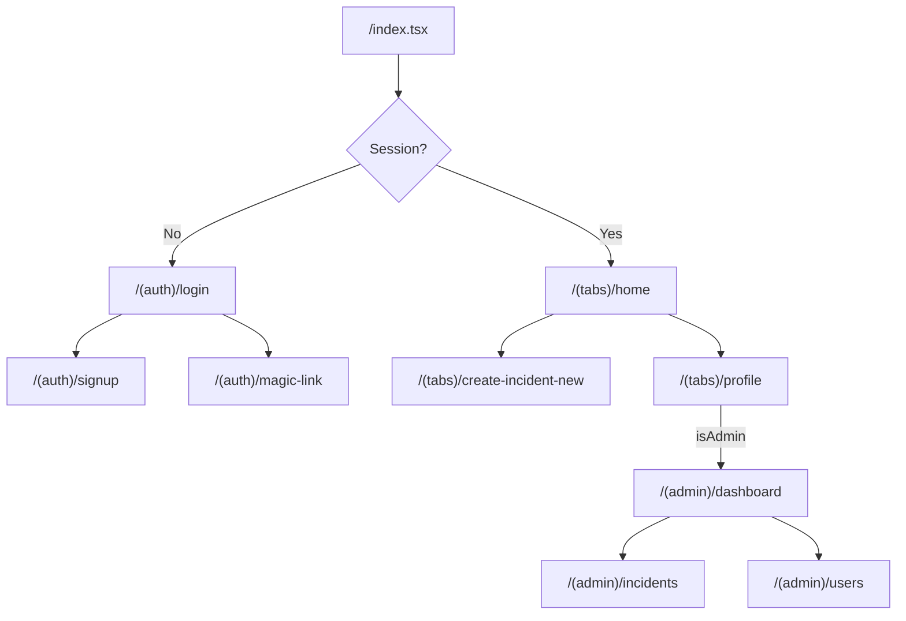
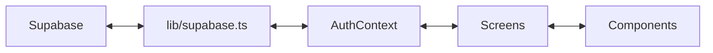
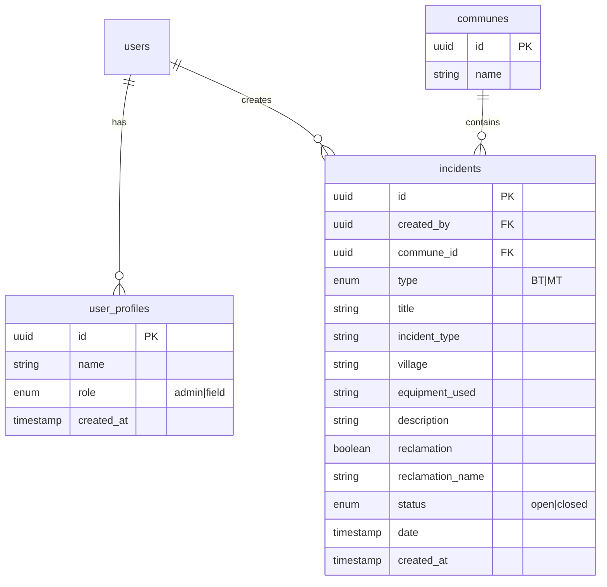

# SRM Mobile App - Comprehensive Technical Audit

> **Project**: SRM (ONEE Incident Management System)  
> **Platform**: React Native (Expo SDK 54)  
> **Audit Date**: January 3, 2026  
> **Auditor**: Antigravity AI

---

## Executive Summary

The SRM mobile application is a **field incident management system** built for ONEE (Morocco's national electricity utility). It enables field agents to report electrical infrastructure incidents (BT/MT voltage types) and provides administrators with a dashboard to manage incidents and team members.

| Metric | Status |
|--------|--------|
| **Architecture** | ⚠️ Moderate - Needs improvement |
| **Type Safety** | ✅ Good - TypeScript with strict mode |
| **Security** | ⚠️ Moderate - Some concerns |
| **Performance** | ✅ Good - Modern stack |
| **Code Quality** | ⚠️ Moderate - Inconsistencies |
| **Scalability** | ⚠️ Moderate - Needs refactoring |

---

## 1. Technology Stack Analysis

### 1.1 Core Dependencies

| Category | Technology | Version | Status |
|----------|------------|---------|--------|
| Framework | Expo | ~54.0.25 | ✅ Latest |
| Runtime | React Native | 0.81.5 | ✅ New Architecture |
| React | React | 19.1.0 | ✅ Latest |
| Router | Expo Router | ~6.0.15 | ✅ File-based routing |
| Backend | Supabase | ^2.86.0 | ✅ Good choice |
| Styling | NativeWind | ^4.2.1 | ✅ TailwindCSS for RN |
| Animation | Reanimated | ~4.1.1 | ✅ Performant |
| Charts | react-native-gifted-charts | ^1.4.68 | ✅ Good |

### 1.2 Stack Strengths

1. **Modern Expo SDK 54** with New Architecture enabled
2. **React Compiler** experimental support enabled
3. **Typed Routes** for compile-time route checking
4. **Supabase** for BaaS with real-time capabilities
5. **NativeWind + Tailwind 4** for utility-first styling

### 1.3 Stack Concerns

> [!WARNING]
> **Missing AsyncStorage Import**: The `lib/supabase.ts` imports `AsyncStorage` but the package `@react-native-async-storage/async-storage` is **NOT in package.json**. This will cause runtime crashes.

```typescript
// lib/supabase.ts line 3
import AsyncStorage from '@react-native-async-storage/async-storage' // ❌ NOT INSTALLED
```

**Fix Required**: Install the package or remove the unused import since `ExpoSecureStoreAdapter` is being used instead.

---

## 2. Project Architecture

### 2.1 Directory Structure

```
SRM/
├── app/                    # Expo Router screens
│   ├── (admin)/           # Admin-only screens (dashboard, incidents, users)
│   ├── (auth)/            # Authentication screens (login, signup, magic-link)
│   ├── (tabs)/            # Main app tab screens
│   ├── _layout.tsx        # Root layout with providers
│   ├── index.tsx          # Entry router (auth gate)
│   └── modal.tsx          # Modal screen
├── components/            # Reusable UI components
│   ├── ui/               # Primitives (collapsible, icons)
│   └── *.tsx             # Feature components
├── constants/            # Theme and color definitions
├── contexts/             # React Context providers
├── hooks/                # Custom React hooks
├── lib/                  # External service configurations
├── assets/               # Static assets (images, fonts)
└── scripts/              # Build/dev scripts
```

### 2.2 Route Architecture



### 2.3 Data Flow Architecture



---

## 3. Security Audit

### 3.1 Authentication ✅ Good

| Check | Status | Notes |
|-------|--------|-------|
| Secure token storage | ✅ | Uses `expo-secure-store` |
| Session persistence | ✅ | Auto-refresh implemented |
| Magic link support | ✅ | OTP-based passwordless login |
| Role-based access | ⚠️ | Implemented but not enforced at route level |

### 3.2 Security Concerns

> [!CAUTION]
> **No Route Guards for Admin Section**
> 
> The `(admin)` route group has **no protection**. Any authenticated user can navigate to `/admin/dashboard` directly. The `isAdmin` flag is only used for UI visibility, not route enforcement.

**Current Code** ([profile.tsx](file:///c:/Users/kourd/Desktop/Projects/SRM/app/%28tabs%29/profile.tsx)):
```tsx
{isAdmin && (
  <TouchableOpacity onPress={() => router.push('/(admin)/dashboard')}>
    {/* Admin button only SHOWN if admin, but route is still accessible */}
  </TouchableOpacity>
)}
```

**Recommended Fix**: Add route protection in `(admin)/_layout.tsx`:
```tsx
export default function AdminLayout() {
  const { isAdmin, loading } = useAuth();
  
  if (loading) return <ActivityIndicator />;
  if (!isAdmin) return <Redirect href="/(tabs)/home" />;
  
  return <Stack>...</Stack>;
}
```

> [!WARNING]
> **Environment Variables Exposed**
> 
> The `.env` file (892 bytes) likely contains Supabase credentials. While Expo uses `EXPO_PUBLIC_` prefix for client-safe variables, ensure:
> - `SUPABASE_ANON_KEY` is used (not service role key)
> - Row Level Security (RLS) is enabled in Supabase

### 3.3 Data Validation

| Location | Validation | Status |
|----------|------------|--------|
| Signup form | Email/Password | ⚠️ Client-side only |
| Create Incident | Required fields | ⚠️ Basic check only |
| Update Incident | Status toggle | ❌ No validation |

**Recommendation**: Implement Zod schemas for form validation.

---

## 4. Code Quality Audit

### 4.1 TypeScript Usage

| Aspect | Rating | Notes |
|--------|--------|-------|
| Strict mode | ✅ | Enabled in tsconfig |
| Type definitions | ⚠️ | Inline types, no shared models |
| Generic usage | ✅ | Proper generics in contexts |
| Any usage | ✅ | None detected |

### 4.2 Identified Issues

#### Issue 1: Duplicate Type Definitions

The `Incident` type is defined in **3 different files** with slight variations:

| File | Definition |
|------|------------|
| [home.tsx](file:///c:/Users/kourd/Desktop/Projects/SRM/app/%28tabs%29/home.tsx#L8-L16) | `Incident` with `title` |
| [incidents.tsx](file:///c:/Users/kourd/Desktop/Projects/SRM/app/%28admin%29/incidents.tsx#L6-L14) | Same as home.tsx |
| Create incident | Implicit type from Supabase insert |

**Recommendation**: Create `types/models.ts` with shared type definitions.

#### Issue 2: Inconsistent Component Patterns

| Pattern | Files Using |
|---------|-------------|
| Function declaration | `explore.tsx`, `themed-text.tsx` |
| Arrow function export | `home.tsx`, `login.tsx` |

**Recommendation**: Standardize on arrow function exports for consistency.

#### Issue 3: Unused Boilerplate Code

The following files are **Expo starter template code** not integrated into the app:

- [explore.tsx](file:///c:/Users/kourd/Desktop/Projects/SRM/app/%28tabs%29/explore.tsx) - Example code with collapsible sections
- [(tabs)/index.tsx](file:///c:/Users/kourd/Desktop/Projects/SRM/app/%28tabs%29/index.tsx) - Welcome screen with HelloWave
- [hello-wave.tsx](file:///c:/Users/kourd/Desktop/Projects/SRM/components/hello-wave.tsx) - Animation demo

**Recommendation**: Remove or repurpose these files.

#### Issue 4: Mixed Styling Approaches

| Approach | Usage |
|----------|-------|
| NativeWind (className) | Main app screens |
| StyleSheet.create() | explore.tsx, parallax-scroll-view.tsx |
| Inline styles | index.tsx loader |

**Recommendation**: Migrate all styling to NativeWind for consistency.

### 4.3 Console Logs in Production Code

> [!IMPORTANT]
> Multiple `console.log` and `console.error` statements exist throughout the codebase. These should be removed or replaced with a proper logging service.

**Files with console statements**:
- `contexts/AuthContext.tsx` - 5 occurrences
- `app/index.tsx` - 2 occurrences
- `app/(tabs)/home.tsx` - 2 occurrences
- `app/(admin)/dashboard.tsx` - 1 occurrence

---

## 5. Performance Audit

### 5.1 React Performance

| Aspect | Status | Notes |
|--------|--------|-------|
| Memo usage | ❌ | No React.memo on list items |
| Callback optimization | ❌ | No useCallback for handlers |
| State management | ⚠️ | Re-renders on every auth change |
| List virtualization | ✅ | Using FlatList correctly |

### 5.2 Data Fetching

| Issue | Location | Impact |
|-------|----------|--------|
| No request caching | All screens | Redundant API calls |
| No optimistic updates | incidents.tsx | UI lag on status toggle |
| Full table scans | dashboard.tsx | `select('*')` inefficient |

**Recommendation**: Implement React Query or SWR for data fetching.

### 5.3 Bundle Analysis

| Dependency | Size Impact | Necessary? |
|------------|-------------|------------|
| react-native-gifted-charts | ~500KB | ⚠️ Only used in admin |
| expo-image | Optimized | ✅ |
| react-native-svg | ~200KB | ✅ Required by charts |

**Recommendation**: Consider lazy-loading admin section with `react.lazy()`.

---

## 6. UI/UX Audit

### 6.1 Design System

| Aspect | Status | Notes |
|--------|--------|-------|
| Color consistency | ⚠️ | Mixed hardcoded colors |
| Typography | ⚠️ | No custom fonts defined |
| Spacing | ✅ | Tailwind classes consistent |
| Dark mode | ⚠️ | Supported but not styled |

### 6.2 Color Palette Issues

The app uses two different color systems:

**Theme Colors** ([theme.ts](file:///c:/Users/kourd/Desktop/Projects/SRM/constants/theme.ts)):
```typescript
tintColorLight = '#0a7ea4'  // Teal
tintColorDark = '#fff'
```

**Inline Colors** (various files):
```typescript
'#2563eb'  // Blue-600 (Tailwind)
'#0000ff'  // Pure blue (index.tsx loader)
```

**Recommendation**: Extend Tailwind theme in `tailwind.config.js` with brand colors.

### 6.3 Accessibility

| Check | Status |
|-------|--------|
| Screen reader labels | ❌ Not implemented |
| Touch target sizes | ⚠️ Some too small |
| Color contrast | ⚠️ Not verified |
| Focus indicators | ❌ Not visible |

---

## 7. Supabase Integration Audit

### 7.1 Database Schema (Inferred)



### 7.2 Query Patterns

| Pattern | Usage | Issue |
|---------|-------|-------|
| `select('*')` | All queries | Over-fetching data |
| `.single()` | Role check | ✅ Correct |
| No pagination | Lists | ⚠️ Performance at scale |
| No error UI | All screens | Silent failures |

### 7.3 Real-time Features

> [!NOTE]
> Supabase real-time subscriptions are **NOT implemented**. Incidents list requires manual refresh.

**Recommendation**: Add real-time subscription for incidents table.

---

## 8. Missing Features Analysis

### 8.1 Critical Missing

| Feature | Priority | Effort |
|---------|----------|--------|
| Route guards for admin | 🔴 High | Low |
| Error boundaries | 🔴 High | Medium |
| Offline support | 🟡 Medium | High |
| Push notifications | 🟡 Medium | Medium |

### 8.2 Nice-to-Have

| Feature | Priority | Effort |
|---------|----------|--------|
| Incident detail page | 🟡 Medium | Low |
| Image attachments | 🟡 Medium | Medium |
| Incident search/filter | 🟢 Low | Low |
| Export to PDF | 🟢 Low | Medium |

---

## 9. Dead Code & Cleanup

### 9.1 Files to Remove

| File | Reason |
|------|--------|
| `app/(tabs)/explore.tsx` | Unused Expo template |
| `app/(tabs)/index.tsx` | Unused welcome screen |
| `components/hello-wave.tsx` | Demo component |
| `app/modal.tsx` | Not linked from anywhere |

### 9.2 Imports to Clean

```diff
// lib/supabase.ts
- import AsyncStorage from '@react-native-async-storage/async-storage'
```

### 9.3 Console Statements to Remove

```bash
# Locations
contexts/AuthContext.tsx:29,34,41,43
app/index.tsx:8,20,24
app/(tabs)/home.tsx:31,36
```

---

## 10. Recommended Improvements

### Priority 1: Security (Immediate)

1. **Add admin route protection** with redirect for non-admins
2. **Remove console logs** from production code
3. **Install missing AsyncStorage** or remove import
4. **Add input validation** with Zod

### Priority 2: Architecture (Short-term)

1. **Create shared types** in `types/` directory
2. **Implement data fetching layer** with React Query
3. **Add error boundaries** for graceful failures
4. **Standardize component patterns**

### Priority 3: Features (Medium-term)

1. **Incident detail screen** with full info and edit
2. **Real-time updates** for incident list
3. **Offline support** with local caching
4. **Push notifications** for new assignments

### Priority 4: Polish (Long-term)

1. **Complete dark mode styling**
2. **Add loading skeletons**
3. **Implement accessibility features**
4. **Add end-to-end tests**

---

## Appendix: File-by-File Summary

| File | Lines | Purpose | Quality |
|------|-------|---------|---------|
| `app/_layout.tsx` | 32 | Root layout with providers | ✅ Good |
| `app/index.tsx` | 27 | Auth gate/router | ⚠️ Has console logs |
| `app/(auth)/login.tsx` | 90 | Login form | ✅ Good |
| `app/(auth)/signup.tsx` | 115 | Registration form | ✅ Good |
| `app/(tabs)/home.tsx` | 118 | Incident list | ⚠️ Inline types |
| `app/(tabs)/create-incident-new.tsx` | 210 | Incident form | ⚠️ Large file |
| `app/(admin)/dashboard.tsx` | 117 | Admin stats | ⚠️ Mock data |
| `contexts/AuthContext.tsx` | 93 | Auth state management | ✅ Good |
| `lib/supabase.ts` | 43 | Supabase client | ⚠️ Unused import |

---

*This audit was generated by Antigravity AI. For questions or implementation assistance, please refer to the accompanying `CONTRIBUTING.md` file.*
