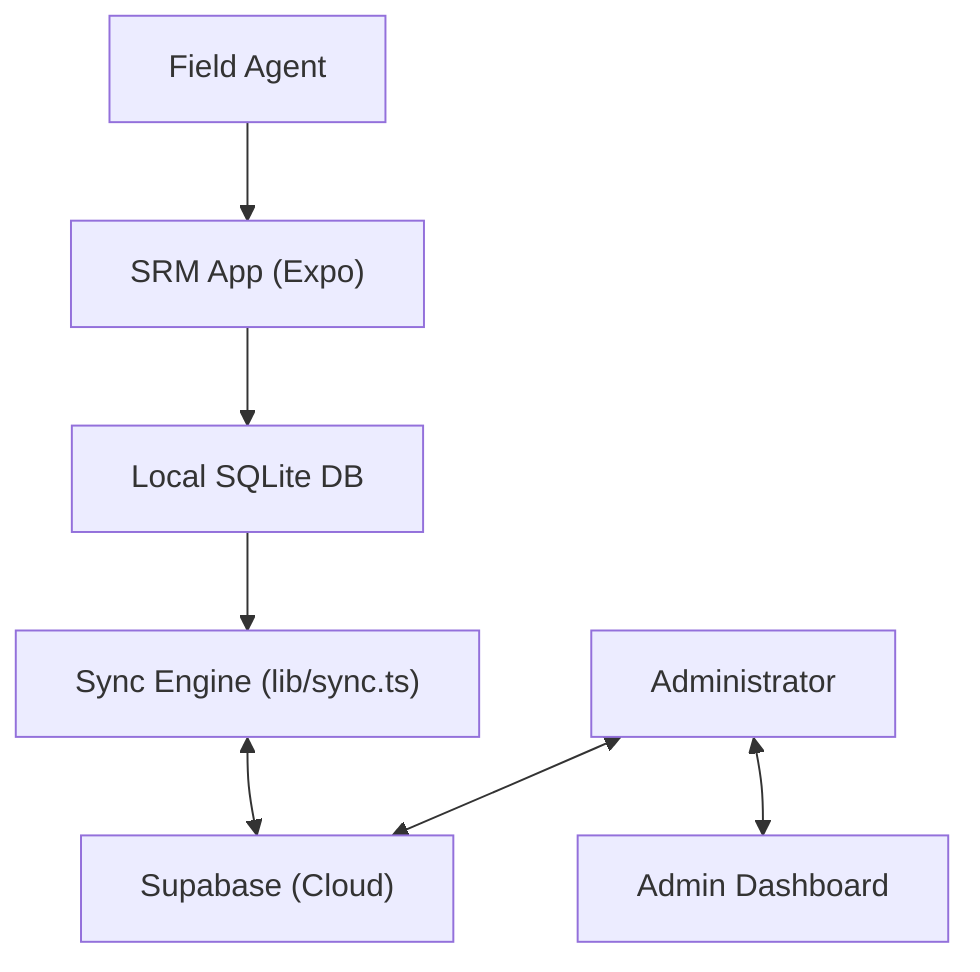

# SRM (ONEE Incident Management System) ⚡

[](https://expo.dev)
[](https://www.typescriptlang.org/)
[](https://supabase.com/)
[](https://www.nativewind.dev/)

SRM is a robust **Field Incident Management System** designed for ONEE (Office National de l'Electricité et de l'Eau Potable - Morocco). It empowers field agents to report and track electrical infrastructure incidents (BT/MT) in real-time, even in areas with limited connectivity, thanks to its offline-first synchronization engine.

---

## ✨ Key Features

- 📱 **Native Mobile Experience**: Built with Expo SDK 54, offering a smooth, high-performance interface on both Android and iOS.
- 🔄 **Offline-First Synchronization**: Local incident reporting using SQLite, with a manual sync engine to bridge data with Supabase.
- 🛠️ **Incident Reporting**: Comprehensive forms for BT (Low Voltage) and MT (Medium Voltage) incidents, including village/commune tracking and equipment usage.
- 📊 **Admin Dashboard**: Real-time stats, incident management, and user administration for oversight.
- 🔐 **Secure Authentication**: Role-based access control with Supabase Auth (Email/Password & OTP).
- 📍 **Location Tracking**: Automatic capture of incident coordinates (Latitude/Longitude).

---

## 🚀 Tech Stack

- **Framework**: [Expo](https://expo.dev/) (SDK 54) with [React Native](https://reactnative.dev/)
- **Navigation**: [Expo Router](https://docs.expo.dev/router/introduction/) (File-based)
- **Backend**: [Supabase](https://supabase.com/) (Auth, PostgreSQL, RLS)
- **Database**: [SQLite](https://docs.expo.dev/versions/latest/sdk/sqlite/) (Local)
- **Styling**: [NativeWind](https://www.nativewind.dev/) (Tailwind CSS for React Native)
- **Animations**: [React Native Reanimated](https://docs.swmansion.com/react-native-reanimated/)
- **Charts**: [React Native Gifted Charts](https://github.com/Abhinandan-Kushwaha/react-native-gifted-charts)

---

## 🏗️ Architecture & Data Flow

SRM follows a hybrid architecture to ensure reliability in the field:



### 📁 Project Structure

```bash
SRM/
├── app/                    # Expo Router screens (Auth, Tabs, Admin)
│   ├── (admin)/            # Admin dashboard and management
│   ├── (auth)/             # Login, Signup, OTP
│   └── (tabs)/             # Field agent core screens (Home, Create Incident)
├── components/             # Reusable UI components
├── db/                     # SQLite schema and model definitions
├── lib/                    # Supabase client and Sync Engine
├── constants/              # Theme and global constants
└── assets/                 # Brand assets and icons
```

---

## ⚙️ Getting Started

### Prerequisites

- [Node.js](https://nodejs.org/) (LTS)
- [Bun](https://bun.sh/) or [pnpm](https://pnpm.io/)
- [Expo Go](https://expo.dev/go) or a Development Build

### Installation

1. **Clone the repository**:
   ```bash
   git clone https://github.com/kourdroid/SRM.git
   cd SRM
   ```

2. **Install dependencies**:
   ```bash
   pnpm install
   ```

3. **Environment Setup**:
   Create a `.env` file in the root and add your Supabase credentials:
   ```env
   EXPO_PUBLIC_SUPABASE_URL=your_project_url
   EXPO_PUBLIC_SUPABASE_ANON_KEY=your_anon_key
   ```

4. **Start the development server**:
   ```bash
   pnpm start
   ```

---

## 🗃️ Database & Sync

The local database uses `expo-sqlite`. Reference data (Communes) and field data (Incidents) are synchronized using `lib/sync.ts`.

- **Communes**: Static reference data pulled from Supabase.
- **Incidents**: Created locally with a `synced` flag. Pushed to Supabase during sync windows.

### Manual Sync Logic
1. Cleanup invalid local records.
2. Pull latest Communes.
3. Pull latest 100 Incidents from server.
4. Push unsynced local Incidents to server.

---

## 📄 License

Proprietary - Developed for ONEE Morocco.

---

Developed with ❤️ by **The Architect** & **Kourdroid**.
