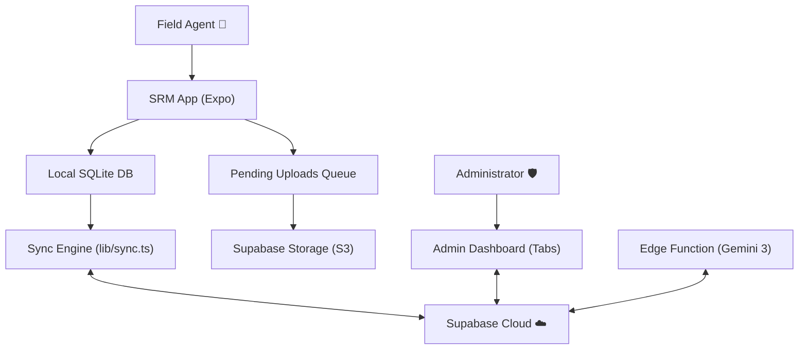

# SRM (ONEE Incident Management System) ⚡

[](https://expo.dev)
[](https://www.typescriptlang.org/)
[](https://supabase.com/)
[](https://www.nativewind.dev/)

SRM is a robust **Field Incident Management System** designed for ONEE (Office National de l'Electricité et de l'Eau Potable — Morocco). It empowers field agents to report and track electrical infrastructure incidents (BT/MT) in real-time, even in areas with limited connectivity, thanks to its offline-first synchronization engine.

---

## ✨ Key Features

### Field Agent
- 📱 **Native Mobile Experience** — Built with Expo SDK 54, React 19, and the New Architecture for smooth, high-performance rendering.
- 🔄 **Offline-First Synchronization** — Local incident reporting via SQLite. Data syncs to Supabase when connectivity is restored.
- 🛠️ **Structured Incident Reporting** — Step-by-step wizard with dynamic sub-type pickers for **16 BT** and **12 MT** incident categories (e.g. *Manque phase*, *Câble conducteur cisaillé*, *Transformateur avarié*).
- 🎙️ **Voice-to-Incident (AI)** — Record audio in Darija/French; a Supabase Edge Function powered by Gemini 3 Flash transcribes and structures the data automatically.
- 🖼️ **Image Attachments** — Capture photos, auto-compress to JPEG (1200px, 70%), and queue for upload to Supabase Storage (`incident-media` bucket). Images are stored locally when offline and uploaded during the next sync window.
- 📍 **Location Tracking** — Automatic capture of GPS coordinates (latitude/longitude) at incident creation.
- 🔐 **Secure Authentication** — Email/Password and OTP (Magic Link) login via Supabase Auth with `expo-secure-store` for token persistence.

### Administrator
- 📊 **Live Dashboard** — KPI cards (Total / En Cours / Résolus / Réclamations), 30-day resolution performance metrics (average and max), and a monthly incidents bar chart.
- 🔍 **Advanced Incident Management** — Full-text search, filterable by status, network type (BT/MT), commune, date range, and reclamation flag. Infinite-scroll list with detail modals showing reporter info, equipment, media attachments, and status toggle.
- 👥 **Team Management** — View all registered users with emails, toggle roles (field ↔ admin), create new accounts directly (without signing out the admin), and delete users with confirmation.
- ⚙️ **Profile & Settings** — Admin profile screen with sign-out functionality.
- 🛡️ **Route Protection** — Server-side role verification in the admin layout; non-admins are redirected immediately.

---

## 🚀 Tech Stack

| Layer | Technology | Version |
|-------|-----------|---------|
| Framework | [Expo](https://expo.dev/) | SDK 54 |
| Runtime | [React Native](https://reactnative.dev/) | 0.81.5 (New Architecture) |
| UI Library | [React](https://react.dev/) | 19.1.0 |
| Navigation | [Expo Router](https://docs.expo.dev/router/introduction/) | v6 (File-based, Typed Routes) |
| Backend | [Supabase](https://supabase.com/) | Auth, PostgreSQL, Storage, Edge Functions |
| Local DB | [expo-sqlite](https://docs.expo.dev/versions/latest/sdk/sqlite/) | Offline-first persistence |
| Styling | [NativeWind](https://www.nativewind.dev/) + `StyleSheet.create` | v4 (Tailwind CSS for RN) |
| Validation | [Zod](https://zod.dev/) | v4 — Runtime boundary validation |
| Animations | [React Native Reanimated](https://docs.swmansion.com/react-native-reanimated/) | v4 |
| Charts | [React Native Gifted Charts](https://github.com/Abhinandan-Kushwaha/react-native-gifted-charts) | v1.4 |
| List Performance | [@shopify/flash-list](https://shopify.github.io/flash-list/) | v2 |

---

## 🏗️ Architecture & Data Flow

SRM follows a hybrid offline-first architecture to ensure reliability in the field:



### 📁 Project Structure

```
SRM/
├── app/                          # Expo Router screens
│   ├── (admin)/                  # Admin dashboard (Tabs layout)
│   │   ├── _layout.tsx           # Tab navigator + route guard
│   │   ├── dashboard.tsx         # KPIs, charts, latest incidents
│   │   ├── incidents.tsx         # Search, filter, manage all incidents
│   │   ├── users.tsx             # Team management (CRUD)
│   │   └── profile.tsx           # Admin settings & sign-out
│   ├── (auth)/                   # Authentication screens
│   │   ├── login.tsx             # Email/Password login
│   │   ├── signup.tsx            # Registration with profile creation
│   │   └── magic-link.tsx        # OTP passwordless login
│   └── (tabs)/                   # Field agent core screens
│       ├── home.tsx              # Incident feed
│       ├── create-incident-new.tsx  # Multi-step incident wizard
│       └── profile.tsx           # Agent profile + admin access
├── components/                   # Reusable UI components
│   ├── AdminTabBar.tsx           # Custom bottom tab bar (accent themed)
│   └── CustomBarChart.tsx        # Styled bar chart wrapper
├── src/core/                     # Business logic layer
│   ├── constants/
│   │   └── incidentTypes.ts      # BT (16 types) & MT (12 types) definitions
│   ├── entities/
│   │   └── admin.ts              # Zod schemas for admin domain
│   └── services/
│       ├── adminService.ts       # Dashboard stats, charts, resolution KPIs
│       ├── incidentAdminService.ts  # Filtered queries, status mutations
│       └── userAdminService.ts   # User CRUD (non-session-swapping create)
├── db/                           # SQLite schema & pending_uploads queue
├── lib/                          # External service configurations
│   ├── supabase.ts               # Supabase client (SecureStore adapter)
│   ├── sync.ts                   # Offline sync engine
│   ├── imageUtils.ts             # Compress & upload to Supabase Storage
├── contexts/
│   └── AuthContext.tsx            # Auth state + role-based access
├── supabase/
│   ├── migrations/               # SQL migrations for views, RPCs
│   └── functions/process-voice/  # Deno Edge Function (Gemini 3 Flash)
└── constants/                    # Theme and color definitions
```

---

## ⚙️ Getting Started

### Prerequisites

- [Node.js](https://nodejs.org/) (LTS)
- [pnpm](https://pnpm.io/) (or npm/yarn)
- [Expo Go](https://expo.dev/go) or a Development Build
- A [Supabase](https://supabase.com/) project

### Installation

1. **Clone the repository**:
   ```bash
   git clone https://github.com/kourdroid/SRM_IM.git
   cd SRM_IM
   ```

2. **Install dependencies**:
   ```bash
   pnpm install
   ```

3. **Environment Setup**:
   Copy `.env.example` to `.env` and fill in your credentials:
   ```bash
   cp .env.example .env
   ```

   ```env
   EXPO_PUBLIC_SUPABASE_URL=https://your-project-id.supabase.co
   EXPO_PUBLIC_SUPABASE_ANON_KEY=your-supabase-anon-public-key
   EXPO_PUBLIC_N8N_WEBHOOK_URL=https://n8n.example.com/webhook/your-id  # Optional
   ```

4. **Run database migrations**:
   Execute the SQL files in `supabase/migrations/` in your Supabase SQL Editor, in order:
   - `20260228013334_dashboard_stats.sql` — Creates the `dashboard_stats_view` and `get_monthly_incidents` RPC.
   - `20260520000000_user_management.sql` — Creates `get_admin_users` and `delete_user_by_admin` RPCs.

5. **Set up Supabase Storage**:
   Create a **public** bucket named `incident-media` via the Supabase Dashboard or SQL Editor.

6. **Start the development server**:
   ```bash
   pnpm start
   ```

---

## 🗃️ Database & Sync

The local database uses `expo-sqlite`. Reference data (Communes) and field data (Incidents) are synchronized using `lib/sync.ts`.

| Data | Direction | Strategy |
|------|-----------|----------|
| **Communes** | Server → Client | Pull on every sync |
| **Incidents** | Bidirectional | Pull latest 100 from server; push unsynced local records |
| **Image Uploads** | Client → Server | Queued in `pending_uploads` table; uploaded during sync when online |

### Sync Sequence
1. Clean up invalid local records (null `commune_id`, missing `type`).
2. Pull latest communes from Supabase.
3. Pull latest 100 incidents from server.
4. Push unsynced local incidents to server.
5. Process `pending_uploads` queue — compress and upload images to the `incident-media` bucket.

### Admin Mutations
All admin write operations (status toggle, role change, user creation/deletion) are **strictly online-only**. Network reachability is verified before every mutation to prevent sync conflicts.

---

## 🔒 Security

- **Authentication**: Supabase Auth with `expo-secure-store` for token persistence. Auto-refresh on app foreground.
- **Route Guards**: Admin layout verifies role from `user_profiles` table before rendering. Non-admins are redirected.
- **RPC Security**: Database functions use `SECURITY DEFINER` with explicit admin role checks; self-deletion is blocked.
- **User Creation**: Uses a non-persisted Supabase client (`persistSession: false`) to create new accounts without signing out the active admin session.
- **Validation**: Zod schemas at API boundaries for all admin mutations (status updates, role changes).

---

## 📄 License

Proprietary — Developed for ONEE Morocco.

---

Developed with ❤️ by **The Architect** & **Kourdroid**.
